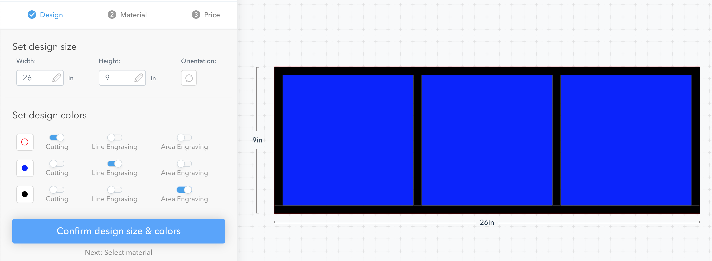
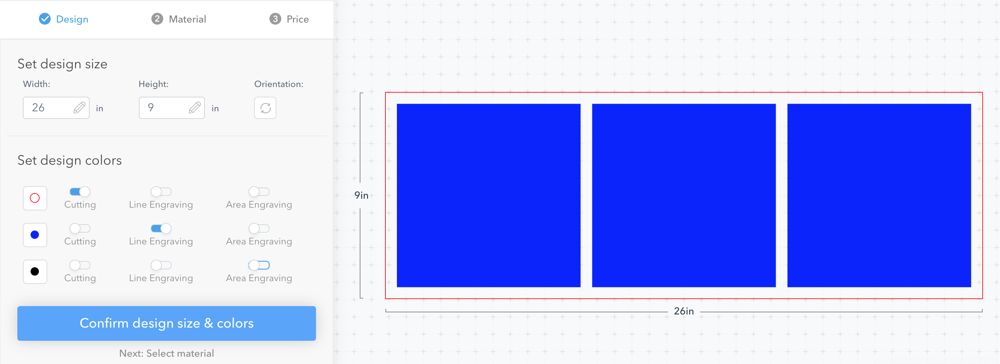

# Triple picture frame

A frame to hold three 8"x8" pictures, so that they all three pictures are equally spaced and somewhat protected from moisture.

Intended to be laser cut out of clear plastic and the pictures mounted behind the frame. 

## Development workflow

Drawn in [Inkscape](https://inkscape.org/). Nothing fancy.

All measurements in inches because the pictures I intent to mount are 8" by 8".

Different colours are used to indicate each type of action with the laser cutter:

* Red is for cutting
* Blue is for line engraving - to indicate where to mount the pictures
* Black is (optionally) for area engraving - to provide a border around the pictures

## Manufacturing

This design could be manufactured from any clear plastic. I chose to make it out of [1mm Clear PETG](https://www.ponoko.com/materials/clear-petg) using the [Ponoko](https://www.ponoko.com/) laser cutting service.

When I got a quote from Ponoko for the design including the area engraved border, it was going to cost USD$110.18

but without the area engraving it only cost USD$12.56 so I ended up going with that

